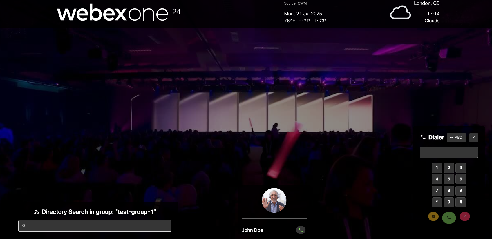
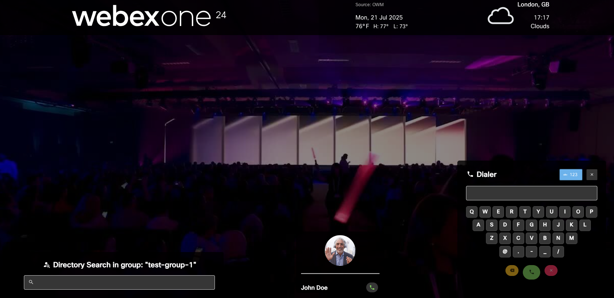
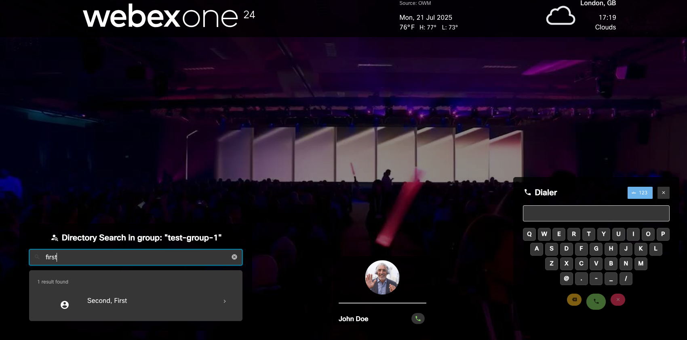

# Kiosk Reception Demo with Directory Search and Manual Dial

## Overview

This application allows you to customize the contact cards, brand logo, background, etc. that make up the UI/controls of a RoomOS device in PWA/Kiosk device. It is based on https://github.com/wxsd-sales/kiosk-reception-demo, and is adding two new capabilities


## New capabilities

1. Manual Dialer

   It support numeric dialing:

   

   And alpha-numeric dialing:

   

2. Directory Search

This search is based on the SCIM 2 Admin API, and is restricted to a specific Control Hub group. So, it will show users only members of the group:



## Setup

These instructions assume that you have administrator access to an Org's Webex Control Hub and a compatible RoomOS 11 device **in a shared workspace**.

1. Create a [Webex Bot Token](https://developer.webex.com/my-apps/new/bot) and [give it full access to your device](https://developer.webex.com/docs/devices#giving-a-bot-or-user-access-to-the-xapi-of-a-device). Note the bot token in a notepad as `WEBEX_TOKEN`.

2. Create a [OWM account](https://home.openweathermap.org/users/sign_up) and get the API token for weather data lookup. You can find the key on your account page under the ["API key"](https://home.openweathermap.org/api_keys) tab. Note the OWM token in a notepad as `OWM_TOKEN`.

3. Note the device identifier by executing the [List Devices API request](https://developer.webex.com/docs/api/v1/devices/list-devices) on the Webex developer portal, it’s the `id` field in the response as `DEVICE_ID`.

4. SCIM 2 API requires the use of an Auth Token. In this example, we created a [Service App](https://developer.webex.com/admin/docs/service-apps) to get an Access Token. Save it as `SERVICEAPP_TOKEN`

5. Get your Webex ORG Id.

6. Add the people you want to be visible for searching to the same Webex Control Hub Group. Note the name of the group in a notepad as GROUP_NAME.

7. Create the URL for the reception kiosk by replacing the appropriate values below

```text
https://wxsd-sales.github.io/kiosk-reception-search-dialer/?people=johndoe@workspace.wxsd.us:6661&background=https://cf-images.us-east-1.prod.boltdns.net/v1/static/1384193102001/46e1a133-643e-435c-b073-8fd26be857e7/757bc84f-02c4-4468-b90b-7f097d265106/1280x720/match/image.jpg&logo=https://www.webexone.com/content/dam/www/us/en/images/webexone/2024/save-the-date/webexone24-logo-white.svg&owmCityId=2643743&owmToken=OWM_TOKEN&webexToken=WEBEX_TOKEN&deviceId=DEVICE_ID&accessToken=SERVICEAPP_TOKEN&groupName=GROUP_NAME&orgId=WEBEX_ORGID
```
In this case, we recommend to have a maximum of 2 persons in the `people`parameter, separated by a comma ","

You can choose your own logo and background images

8. Visit the org's [Control Hub device page](https://admin.webex.com/devices), choose your device and make the following changes using the "All configuration" link:
   - Set the value for `NetworkServices > HTTP > Mode` to `HTTP+HTTPS`
   - Set the value for `WebEngine > Mode` to `On`
   
   Additionally, if running in Kiosk Mode (Desk and Board series devices):
   - Set the value for `UserInterface > Kiosk > URL` to the URL you created in Step 4 above
   - Set the value for `UserInterface > Kiosk > Mode` to `On`

   Additionally, if running in PWA Mode (Room series devices):
   - Set the value for `WebEngine > Features > Xapi.Peripherals.AllowedHosts.Hosts` to `*`
   - Set the value for `UserInterface > HomeScreen.Peripherals.WebApp.URL` to the URL you created in Step 4 above

## Support

Please, contact the WXSD team at wxsd@external.cisco.com for questions. Or, if you're a Cisco employee, reach out to us on the Webex App via our bot (globalexpert@webex.bot). In the "Engagement Type" field, choose the "API/SDK Proof of Concept Integration Development" option to reach our team.
